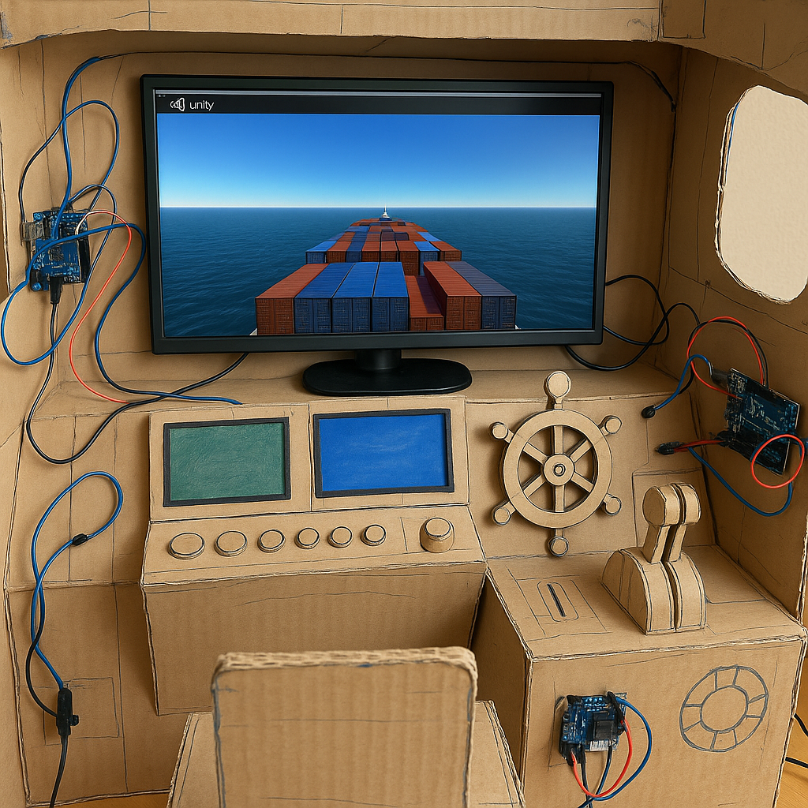

  
*DALL·E: AI-generated concept of how we **might** prototype maritime interactions.*

## 👉 [Click here to apply via our form](https://docs.google.com/forms/d/e/1FAIpQLSfBshh-94YoQmFnASepgmsYfz5d4ntSBTZH7LuVcR4dz_7foQ/viewform?usp=header)

Join us for an exciting workshop that delves into the dynamic world of interaction design for automation through an engaging hands-on simulation! Participants are invited to bring their physical prototypes or share innovative conceptual ideas about interaction, control, and evaluation. Our collaborative simulation environment promises to spark vibrant discussions and inspire fresh approaches to designing and evaluating interfaces. We welcome contributions from diverse fields, including Haptics, Digital Fabrication, Human-Robot Interaction, Interface Design, and Simulation Research.

To apply, please fill out our [interest form](https://docs.google.com/forms/d/e/1FAIpQLSfBshh-94YoQmFnASepgmsYfz5d4ntSBTZH7LuVcR4dz_7foQ/viewform?usp=header). You can either respond to a few short questions or upload a short PDF (up to 4 pages in DIS22 pictorial format) describing a prototype, interaction concept, or evaluation scenario. An optional video link can also be included.

Participants will have 5-10 minutes to present their work during the workshop. Submissions will be reviewed for relevance and contribution to the workshop goals. 

| Milestone                    | Date           |
|-----------------------------|----------------|
| Call for Participation Released | May 18, 2025 |
| Rolling Acceptances Begin   | May 23, 2025   |
| Simulation Released         | May 30, 2025   |
| Rolling Acceptances End     | June 20, 2025  |

The application form will be available online at the beginning of next week.
